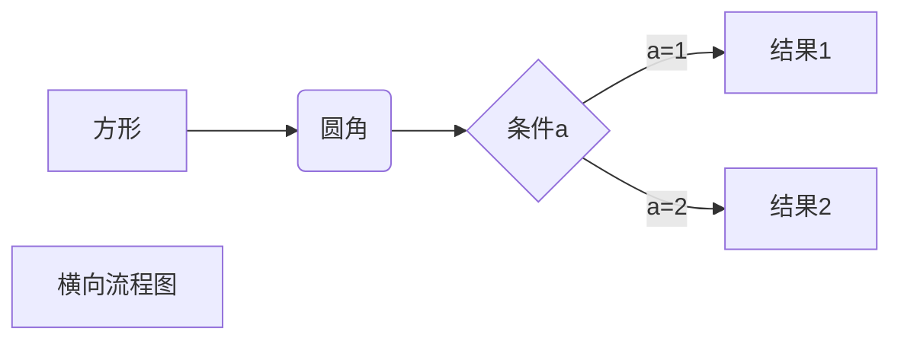
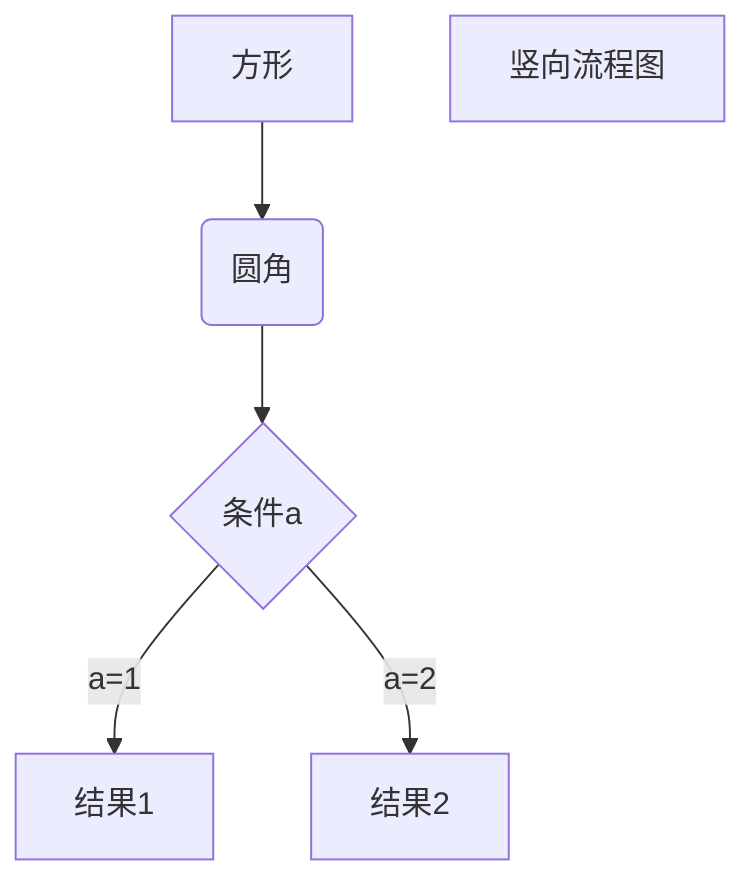
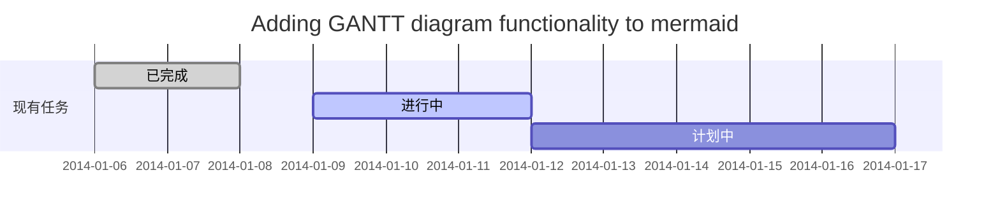
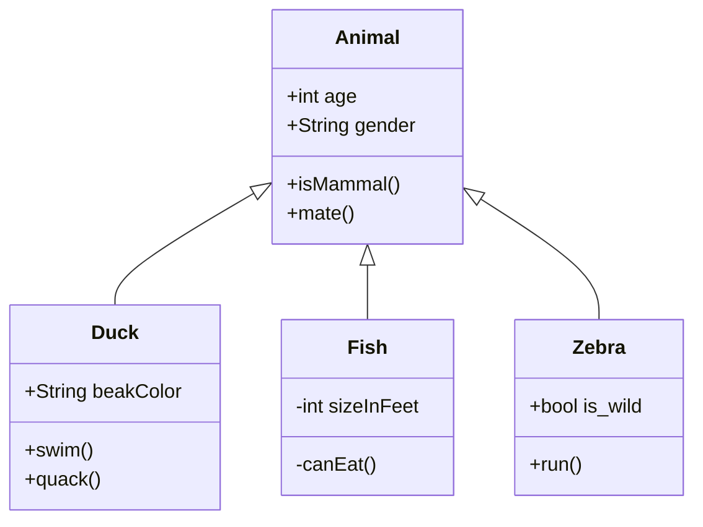

# MarkDown使用手册

参考：
*[少数派markdown完全使用详解](https://sspai.com/post/54912)*
*[菜鸟教程](https://www.runoob.com/markdown/md-tutorial.html)*


## 标题

标题表示如下，从上到下分别表示一级到四级标题

```markdown
# 一级标题1
## 二级标题2
### 三级标题3
#### 四级标题4
##### 五级标题5
###### 六级标题6
```

## 段落

### 换行与空格

* 软换行：<kbd>SHIFT</kbd>+<kbd>ENTER</kbd>进行软换行，软换行只在编辑页面可以看到，当文档被导出时换行会被忽略
* 硬换行：通过<kbd>SPACE</kbd>+<kbd>SPACE</kbd>+<kbd>SHIFT</kbd>+<kbd>ENTER</kbd>完成硬换行。硬换行将在文档被导出时被保留，且不存在换段时的段后距离。
* 换段：通过<kbd>ENTER</kbd>完成一次换段，`Typora`会自动完成两次软换行，从而完成一次换段。即换段时通过段与段之间通过添加空行来完成。
* 空格：在输入连续的空格后，`Typora`会在编辑器视图中保留这些空格，但是导出或打印文件时，会被省略成为一个。  
可在源代码模式下添加`\`转义或者用html风格的`&nbps`保持连续空格。
* Windows风格（CR+LF）与UNIX风格（CR）的换行符：CR表示回车`\r`，即回到一行的开头，而LF表示换行`\n`，即另起一行。  
  所以Windows风格的换行符本质时[换行+回车]，而UNIX风格的换行符是[换行]。因此windows系统打开unix下的文档会全部显示在一行，需要通过`文件-偏好设置-编辑器-默认换行符`进行修改。

***

### 字体

有以下几种字体

```markdown
*斜体文本*
**粗体文本**
_斜体文本_
__粗体文本__
```

***

### 分割线

一行中用三个以上的星号`*`，减号`-`，底线`_`来建立分割线，行内不可以有任何东西，但是符号之间可以插入空格。

```markdown
***
---
___
* * *
```

***

### 删除线

```
~~需要删除的文本~~
```

~~***需要删除的文本***~~

***

### 下划线

下划线通过HTML`<u>`来实现，语法如下

```markdown
<u>下划线</u>
```
结果：<u>下划线</u>
***

### 脚注

对文本的补充说明，以及效果如下：

```markdown
创建一个[^要注明的内容]
[^要注明的内容]:这是一个脚注
```
创建一个[^要注明的内容]

[^要注明的内容]:这是一个脚注

## 列表

### 有序列表

通过数字后跟`.`表示：

```markdown
1. 这是第一项
2. 这是第二项
```


1. 这是第一项
2. 这是第二项

### 无序列表

通过在文本前加`*`、`-`、`+`来实现：

```markdown
* 这是第一项
+ 这是第二项
- 这是第三项
```

* 这是第一项
+ 这是第二项

- 这是第三项

### 列表嵌套

在子列表前添加4个空格即可：

```markdown
1. 第一项：
    * 第一项的第一个元素
    * 第一项的第二个元素
    + 第一项的第三个元素
2. 第二项：
	* 第二项的第一个元素
	+ 第二项的第二个元素
	- 第二项的第三个元素
```

1. 第一项：
    * 第一项的第一个元素
    * 第一项的第二个元素
    
    + 第一项的第三个元素
2. 第二项：
	* 第二项的第一个元素
	+ 第二项的第二个元素
	
	- 第二项的第三个元素

## 区块

区块引用：在段落开头处添加`>`，后紧跟一个空格实现，同时也可以进行嵌套  
结果如下：  

```markdown
> 区块引用
>> 引用块的第二行
>>> 引用块的第三行
```

> 区块引用
> > 引用块的第二行
> >
> > > 引用块的第三行

### 列表中使用嵌套

```markdown
1. 这是第一项
	> 引用块
	> 引用块第二行
2. 这是第二项
```

1. 这是第一项
	> 引用块
	>
	> 引用块第二
	
2. 这是第二项

## 链接

`[链接名称](链接地址)`或者<链接地址>

```markdown
[这是一个链接](https://www.baidu.com)
或者
<www.baidu.com>
<980161025@qq.com>
或者
[这是必应搜索][1]
[这是百度搜索网站][]
[1]:https://www.bing.com "必应搜索"
[这是百度搜索网站]:https://www.baidu.com "百度搜索"
```
[这是一个链接](https://www.baidu.com)

或者

<www.baidu.com>

<980161025@qq.com>

或者

[这是必应搜索][bing]


[这是百度搜索网站][baidu]

[bing]: https://www.bing.com "必应搜索"

[baidu]: https://www.baidu.com "百度搜索"


### 内部链接

内部链接跳转只能到标题，当需要跳转到某一文本中时需要使用html的`<a>`标签.

```markdown
请跳转到位置一<a name="point">这里是位置一</a>
[跳转到位置一](#point)
<a href="#point">跳转到位置一</a>
[跳转到标题](#标题)
<a href="#段落">跳转到段落</a>
```

请跳转到位置一<a name="point" style='color:red'>这里是位置一</a>  
[跳转到位置一](#point)  
<a href="#point">跳转到位置一</a>  
[跳转到标题](#标题)  
<a href="#段落">跳转到段落</a>

## 图片

图片语法如下：
```markdown


```
### 各部分说明
* 一个惊叹号<kbd>!</kbd>  
* 接着一个方括号，里面放上图片的替代文字，也就是当图片还未加载成功时显示的替换文本
* 接着一个普通括号，里面放上图片的网址，以及可选的用双引号（或单引号或括弧）包住的’title’文字，两者之间用若干个空格分割开来，如果加上了’title’文字，那么鼠标移到该图片上就会显示出该文字
* vsCode 中Markdown preview enhance只支持相对路径打开本地图片
  
  

### 表格

```markdown
|	表头	|	表头	|
|	----	|	----	|
|	单元格	|	单元格	|
|	单元格	|	单元格	|

| 左对齐 | 右对齐 | 居中对齐 |
| :-----| ----: | :----: |
| 单元格 | 单元格 | 单元格 |
| 单元格 | 单元格 | 单元格 |
```

| 左对齐    |    右对齐 | 居中对齐  |
| :-------- | --------: | :-------: |
| 单元格111 | 单元格222 | 单元格333 |
| 单元格    |    单元格 |  单元格   |

## 高级技巧

### 支持的HTML元素
不在Markdown涵盖范围之内的标签，都可以直接在文档里面用HTML撰写。  
目前支持的HTML元素有\<kbd> \<b> \<i> \<em> \<sup> \<sub> \<br>等，如：
```markdown
使用 <kbd>Ctrl</kbd>+<kbd>Alt</kbd>+<kbd>Del</kbd> 重启电脑
```
结果：  
使用 <kbd>Ctrl</kbd>+<kbd>Alt</kbd>+<kbd>Del</kbd> 重启电脑

### 转义

Markdown 使用了很多特殊符号来表示特定的意义，如果需要显示特定的符号则需要使用转义字符，Markdown 使用反斜杠转义特殊字符：
```markdown
**文本加粗**
\*\*正常显示星号\*\*
```
结果：  
**文本加粗**  
\*\*正常显示星号\*\*

$$y^2 + x^2 = z$$

Markdown 支持以下这些符号前面加上反斜杠来帮助插入普通的符号：
```
\   反斜线
`   反引号
*   星号
_   下划线
{}  花括号
[]  方括号
()  小括号
#   井字号
+   加号
-   减号
.   英文句点
!   感叹号
```
### 公式
当你需要在编辑器中插入数学公式时，可以使用两个美元符 $$ 包裹 TeX 或 LaTeX 格式的数学公式来实现。提交后，问答和文章页会根据需要加载 Mathjax 对数学公式进行渲染。如：
```markdown
$$ \Vert\vec{x}\Vert_1=\sum_{i=1}^N\vert{x_i}\vert $$
```
输出结果为：  
$$ \Vert\vec{x}\Vert_1=\sum_{i=1}^N\vert{x_i}\vert $$

### 流程图
需要下载mermaid插件：
**横向流程图**
````

````


**竖向流程图**
````

````


**GANTT**
````

````


**UML**
````

````

